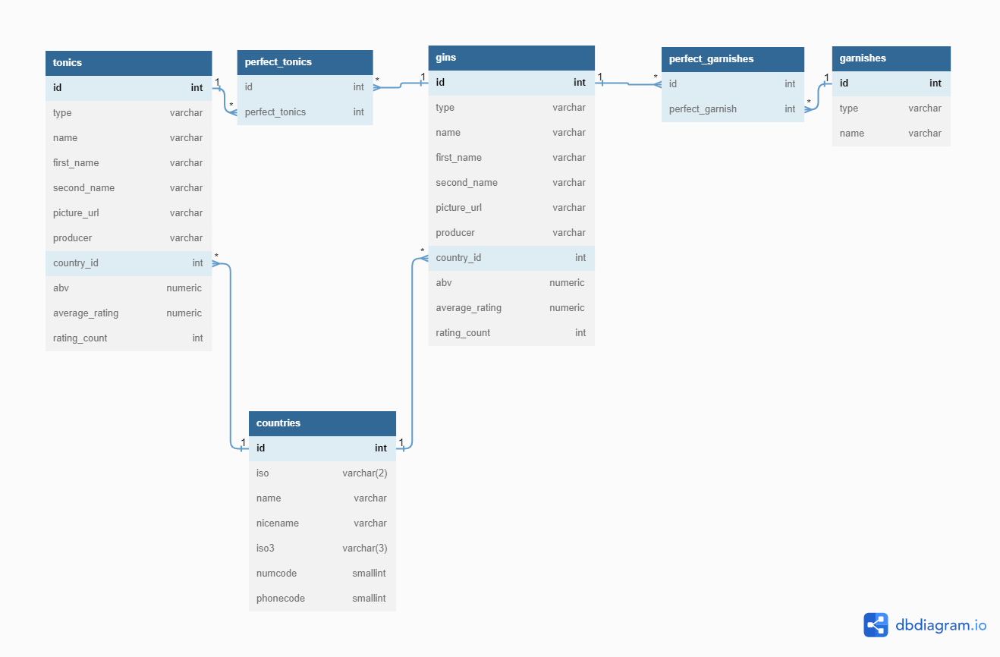

# Ginventory DWH

## Description

The aim of this project is to reverse engineer the private API of the Ginventory application and use the data gained from this exercise to create a DWH on Redshift. I bring the API data to a normalized form, and create the basis of a DWH model. 

## Project structure

* Data acquisition, API
    * Reverse engineering the API
    * Build scraper and save data from API
    * Use local file for further operations
* Data cleaning and normalization
    * Fixing formatting issues
    * Fixing naming conventions
    * Fixing wrong data types
    * Save tables in normal form
* Explore the dataset
* Setup Redshift infrastructure
    * Create role
    * Create cluster
    * Allow ingress for VPC
* Load data to Redshift
* Execute data checks
* Delete cluster and role

## How to use

- Clone repo
- Change the config.cfg file, namely the following parameters must be provided: AWS KEY, AWS SECRET, AWS REGION and api_key for the Ginventory app. 
You need an AWS user (with admin priviledges for testing purposes) for the AWS KEY, SECRET and REGION variables. For the api_key you will need to emulate the Android app and see the requests being sent, and use your API key from there.
- If you want to run the parser yourself, please also provide appropriate values for headers_user_agent and headers_from. Otherwise just read in from the provided local file.
- You are all confugired, you can step through the cells of the jupyter notebook.

## Data model

## TO-DO

* Create customer and purchases data with faker
* Setup Airflow to schedule daily imports of purchase data